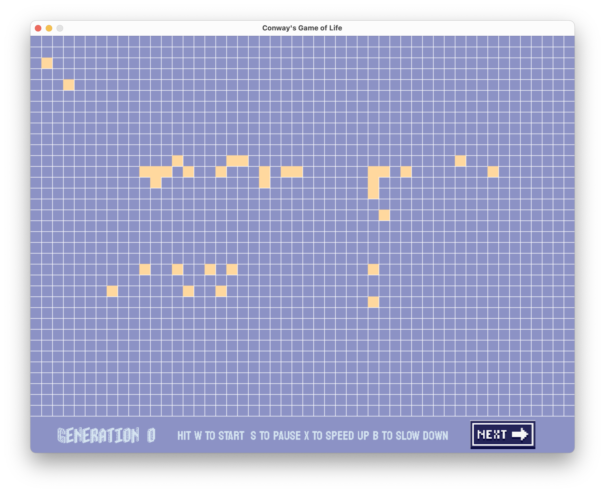
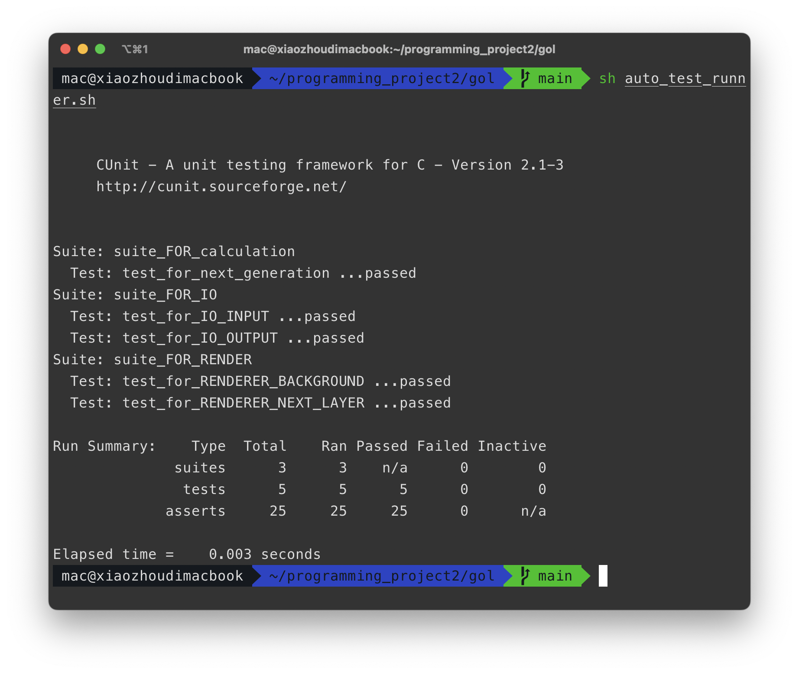
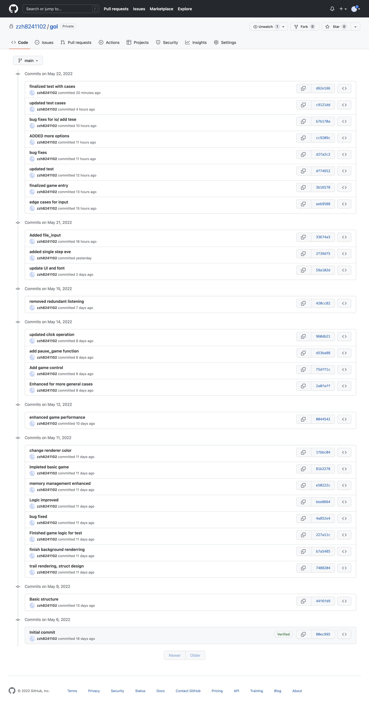

[toc]

## XJCO1921-Programming Project – Coursework2: Conway's Game of Life with Interactive GUI

**Zihan Zhou | Student ID: 2020110026 | University ID: 201487560**

### Brief Introduction

This project revisits a classic in the realm of retro games, implemented in pure C programming language. It's an interactive version of **Conway's Game of Life**, a zero-player game conceived by the renowned mathematician John Conway in the 1970s. The essence of this project lies in its simulation of an automaton game with a **Graphical User Interface** (GUI), powered by the SDL graphical library. Players have the unique opportunity to observe the evolutionary process at **each step**, **manipulate the game progression** (either through direct input or reading from a verified file), **alter the game state** (including options like START, PAUSE, SINGLE STEP, and CLICK-TO-TOGGLE on the grid), and **save the current game state**. 



### How to Run the Programme

#### Game Compilation

```bash
# Navigate to the root directory of this project and execute:
$ make 
# Alternatively, use:
$ make all
# To clean up the directory, use:
$ make clean
# Note: Source code is located in the src directory.


### How to Run the Programme

#### Game Compilation

```bash
# Navigate to the root directory of this project and execute:
$ make 
# Alternatively, use:
$ make all
# To clean up the directory, use:
$ make clean
# Note: Source code is located in the src directory.


### How to run the progrmme

#### Game compliation

``` bash
## simply go to the root dir of this project hit
$ make 
## or
$ make all
## if you want to clean the space, use
$ make clean
## note that source code is under the src dir
```


#### Run the programme in different mode

```bash
## After complation, you can run the game in mutiple ways
## 1. direct run, use 
./gol
## 2. use the game.config file, which will be verified
./gol io_files/game.config
## 3. wrong cla, which will prompted as direct run
./gol wrong_url wrong_argc

```

#### Run the automatic test-suite

```bash
## go to the root dir of this project,run
sh auto_test_runner.sh
```

And you will see the test output:



### git URL and Screen Shot of it


URL:https://github.com/zzh8241102/gol

Screen_shot:



